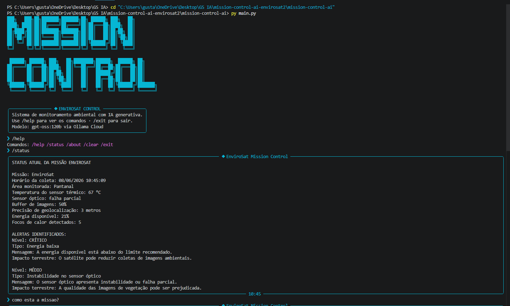
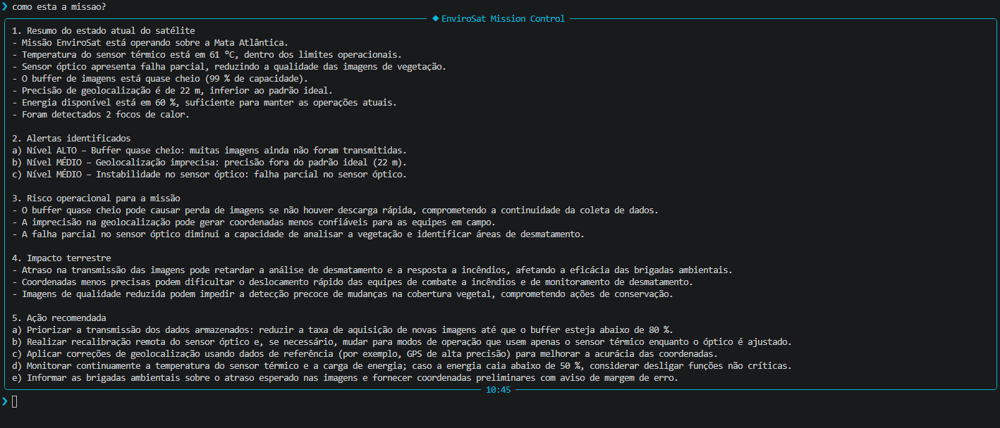

# Mission Control AI - Global Solution 2026.1

## Trilha: EnviroSat - Observação Ambiental

## Integrantes

- Gustavo de Souza Correa RM-570746
- Arthur Tae Gun Yong RM-570647 

## Disciplina

Prompt Engineering and Artificial Intelligence

## Objetivo do Projeto

Este projeto simula um sistema de centro de controle para um satélite de observação ambiental. O sistema gera dados simulados de telemetria, identifica situações críticas utilizando regras desenvolvidas em Python e utiliza Inteligência Artificial Generativa por meio da Ollama Cloud para interpretar os dados e apresentar análises em linguagem natural.

## Problema Resolvido

O EnviroSat monitora áreas ambientais e auxilia na detecção de focos de calor, monitoramento de vegetação e identificação de riscos relacionados a incêndios e desmatamento. O objetivo é fornecer informações que possam apoiar equipes responsáveis pela preservação ambiental e resposta a emergências.

## Persona Atendida

- Operador de centro de controle ambiental
- Coordenador de brigada de combate a incêndio
- Analista de compliance ambiental

## Análise de Impacto e Modelo de Negócio

### 1. Qual o problema real terrestre que esta missão resolve?

A missão EnviroSat tem como objetivo monitorar áreas ambientais por meio de observação via satélite. O sistema auxilia na identificação de focos de calor, monitoramento da vegetação, acompanhamento de áreas de desmatamento e suporte a brigadas ambientais.

Com isso, é possível detectar problemas ambientais com maior rapidez, permitindo respostas mais eficientes em situações de incêndios florestais e degradação ambiental.

---

### 2. Quem paga pela solução?

O modelo adotado é híbrido.

O setor público pode utilizar a solução por meio de órgãos ambientais e de monitoramento, como INPE, IBAMA, Defesa Civil e secretarias estaduais de meio ambiente.

O setor privado também pode utilizar os dados gerados pelo sistema, especialmente empresas do agronegócio, cooperativas agrícolas, concessionárias florestais, seguradoras e organizações que dependem de monitoramento ambiental contínuo.

---

### 3. Métrica de impacto

Se o satélite operar de forma saudável durante um ano inteiro, a missão poderá monitorar milhares de quilômetros quadrados de áreas ambientais, contribuindo para:

* Detecção antecipada de focos de incêndio;
* Monitoramento contínuo de áreas de vegetação;
* Identificação de regiões com possível desmatamento;
* Apoio às equipes de combate a incêndios;
* Produção de relatórios ambientais mais precisos.

Como estimativa, o sistema pode auxiliar no monitoramento de mais de 100.000 km² de áreas ambientais ao longo de um ano, contribuindo para a detecção antecipada de incêndios e para a preservação de áreas protegidas.

### 4. Modelo de negócio

O modelo de negócio principal é Dado como Serviço (Data as a Service - DaaS).

Os clientes contratam acesso aos dados coletados e às análises geradas pelo sistema por meio de assinatura periódica.

Além disso, o projeto pode ser utilizado em contratos governamentais de monitoramento ambiental, parcerias público-privadas e serviços especializados para organizações que necessitam de informações ambientais em tempo real.

---

## Demonstração

### Tela Inicial do Sistema

### Exemplo de Análise da IA

---

## Funcionalidades

- Geração de telemetria simulada
- Monitoramento de sensores ambientais
- Detecção automática de alertas
- Avaliação de riscos operacionais
- Análise contextualizada utilizando IA generativa
- Explicação do impacto terrestre das anomalias detectadas
- Interface CLI inspirada em sistemas de Mission Control

## Tecnologias Utilizadas

- Python
- Ollama Cloud
- Rich
- prompt-toolkit
- PyFiglet
- python-dotenv

## Estrutura do Projeto

mission-control-ai/

├── README.md

├── main.py

├── banner_ascii.py

├── requirements.txt

├── .env.example

├── .gitignore

├── src/

│ ├── __init__.py

│ ├── ui.py

│ ├── engine.py

│ ├── telemetria.py

│ └── alertas.py

├── prompts/

│ └── system_prompt.md

├── data/

└── assets/
screenshot_banner.png
screenshot_analise.png

## Como Executar

### 1. Instalar as dependências

pip install -r requirements.txt

### 2. Criar o arquivo .env

OLLAMA_API_KEY=sua_chave_aqui_sem_aspas

### 3. Executar o sistema

python main.py

## Comandos da CLI

- /help - mostra os comandos disponíveis
- /status - exibe a telemetria atual
- /about - apresenta informações do projeto
- /clear - limpa a tela do terminal
- /exit - encerra o sistema

## Funcionamento

O sistema coleta dados simulados do satélite EnviroSat, incluindo:

- Temperatura do sensor térmico
- Energia disponível
- Buffer de imagens
- Precisão de geolocalização
- Quantidade de focos de calor detectados

Após a coleta, regras implementadas em Python analisam os dados e identificam possíveis alertas. Em seguida, a IA recebe a telemetria, os alertas e a pergunta realizada pelo usuário para gerar uma resposta contextualizada sobre o estado da missão.

## Impacto Terrestre

Quando o satélite apresenta falhas operacionais, o monitoramento ambiental pode ser comprometido. Isso pode causar atrasos na detecção de incêndios, dificultar ações de combate ao desmatamento e reduzir a eficiência das equipes ambientais que atuam em campo.

## Conclusão

O projeto Mission Control AI - EnviroSat demonstra a aplicação da Inteligência Artificial Generativa no monitoramento de missões espaciais voltadas à observação ambiental.

A solução integra telemetria simulada, regras de decisão em Python e análise por IA para auxiliar operadores na identificação de riscos operacionais e seus impactos no combate a incêndios, monitoramento ambiental e preservação de áreas protegidas.

## Vídeo de demonstração
🎥 [Assistir no YouTube](https://youtu.be/iAhHidtbBgQ)
